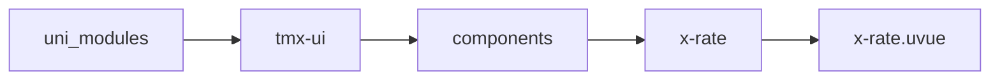
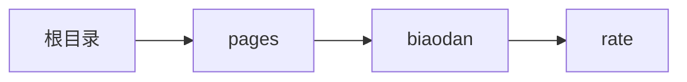

# 评分 xRate
-------
<ViewMobile url="/pages/biaodan/rate" />

## 介绍

评分组件，只读和禁用等属性,它也是支持手势左右滑动设置分值。

## 平台兼容

| Harmony | H5 | andriod | IOS | 小程序 | UTS | UNIAPP-X SDK | version |
| --- | --- | --- | --- | --- | --- | --- | --- |
| ☑ | ☑ | ☑️ | ☑️ | ☑️ | ☑️ | 4.76+ | 1.1.18 |


## 文件路径

``` ts

@/uni_modules/tmx-ui/components/x-rate/x-rate.uvue
```



## 使用

``` ts

<x-rate></x-rate>
```

## Props 属性

| 名称 | 说明 | 类型 | 默认值 |
| ------ | ---- | ---- | ---- |
| modelValue | `当前分值，等同v-model`<br> | `number` | `0` |
| count | `最大评分数量`<br> | `number` | `5` |
| color | `选中的颜色，默认空值取全局值`<br> | `string` | `""` |
| unColor | `未选中的颜色`<br> | `string` | `"#cacaca"` |
| darkUnColor | `未选中的暗黑背景颜色`<br>`空时取InputDark表单颜色`<br> | `string` | `"#8b8b8b"` |
| size | `尺寸`<br> | `string` | `"21"` |
| space | `间隙`<br> | `string` | `"4"` |
| icon | `选中的图标`<br> | `string` | `"star-fill"` |
| unicon | `未选中的图标`<br> | `string` | `"star-line"` |
| readonly | `是否只读状态`<br> | `boolean` | `false` |
| disabled | `是否禁用状态`<br> | `boolean` | `false` |
| showScore | `是否显示右侧评分值`<br> | `boolean` | `false` |
| fontSize | `右侧文本分值文本的字号`<br> | `string` | `"14"` |
| half | `是否开启半星`<br>`开启半星后，自定的unicon和icon失效。`<br> | `boolean` | `false` |


## Events 事件

| 名称 | 参数 | 说明 |
| ------ | ---- | ---- |
| change | `score: number` | 评分变换时触发 |
| update:modelValue | `-` | - |


## Slots 插槽

| 名称 | 说明 | 数据 |
| ------ | ---- | ---- |
| score | `文本分值的右侧插槽` | score: number<br> |
| default | `-` | - |


## Ref 方法

| 名称 | 参数 | 返回值 | 说明 |
| ------ | ---- | ---- | ---- |


## 示例文件路径

``` json

/pages/biaodan/rate
```



## 示例源码

::: details uvue

<<< ../../../../pages/biaodan/rate.uvue{vue}

:::

