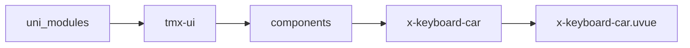
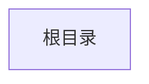

# 车牌键盘 xKeyboardCar
-------
<ViewMobile url="" />

## 介绍

功能齐全的车牌快速输入键盘。

## 平台兼容

| Harmony | H5 | andriod | IOS | 小程序 | UTS | UNIAPP-X SDK | version |
| --- | --- | --- | --- | --- | --- | --- | --- |
| ☑ | ☑ | ☑️ | ☑️ | ☑️ | ☑️ | 4.76+ | 1.1.18 |


## 文件路径

``` ts

@/uni_modules/tmx-ui/components/x-keyboard-car/x-keyboard-car.uvue
```



## 使用

``` ts

<x-keyboard-car></x-keyboard-car>
```

## Props 属性

| 名称 | 说明 | 类型 | 默认值 |
| ------ | ---- | ---- | ---- |
| modelValue | `当前输入的值`<br> | `string` | `""` |
| maxLen | `最大长度`<br> | `number` | `8` |
| modelShow | `当前打开的状态。`<br>`等同v-model:model-show`<br> | `boolean` | `false` |
| title | `顶部标题，默认：安全键盘请放心输入`<br> | `string` | `""` |
| color | `主按钮色，空值取全局主题`<br> | `string` | `""` |
| btnColor | `按钮背景`<br> | `string` | `'white'` |
| bgColor | `键盘背景`<br> | `string` | `'info'` |
| fontColor | `文字颜色`<br> | `string` | `'#3b3b3b'` |
| hold | `点击确认是否保持键盘不收起`<br> | `boolean` | `false` |


## Events 事件

| 名称 | 参数 | 说明 |
| ------ | ---- | ---- |
| change | `value: string` | 值变化时触发 |
| update:modelShow | `-` | 变量控制打开状态<br>等同v-model:model-show |
| confirm | `value: string` | 确认时触发 |
| cancel | `value: string` | 关闭取消时触发 |
| update:modelValue | `-` | - |


## Slots 插槽

| 名称 | 说明 | 数据 |
| ------ | ---- | ---- |
| default | `插槽,默认触发打开选择器。你的默认布局可以放置在这里。` | show: boolean<br> |


## Ref 方法

| 名称 | 参数 | 返回值 | 说明 |
| ------ | ---- | ---- | ---- |


## 示例文件路径

``` json


```



## 示例源码

::: details uvue


:::

