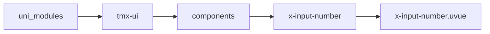
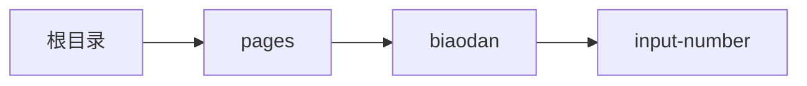

# 输入框 xInputNumber
-------
<ViewMobile url="/pages/biaodan/input-number" />

## 介绍

表单数字输入框，样式可定制化强，允许整数，小数限制,注意配合属性type和inputmodel来实现业务功能体验

## 平台兼容

| Harmony | H5 | andriod | IOS | 小程序 | UTS | UNIAPP-X SDK | version |
| --- | --- | --- | --- | --- | --- | --- | --- |
| ☑ | ☑ | ☑️ | ☑️ | ☑️ | ☑️ | 4.76+ | 1.1.18 |


## 文件路径

``` ts

@/uni_modules/tmx-ui/components/x-input-number/x-input-number.uvue
```



## 使用

``` ts

<x-input-number></x-input-number>
```

## Props 属性

| 名称 | 说明 | 类型 | 默认值 |
| ------ | ---- | ---- | ---- |
| _style | `自定义style`<br>`标签请写_style,不是-style，插件文档转换问题`<br> | `string` | `""` |
| focusBorder | `输入框统一的聚集样式`<br>`第3表示默认的边颜色(如果为空表示默认边颜色不生效.),第4表示聚焦时的颜色(空表示取全局color,transparent为不生效就是没有聚集样式)`<br>`['2px','solid','','']`<br>`全局的配置名称是:inputFocusBorder,可以全局设置.`<br> | `Array` | `():string[] => [] as string[]` |
| placeholderStyle | `占位的样式`<br> | `string` | `""` |
| _class | `自定class`<br>`标签请写_class,不是-class，插件文档转换问题`<br> | `string` | `""` |
| round | `输入框圆角`<br> | `string` | `""` |
| showClear | `是否显示清除图标`<br> | `boolean` | `false` |
| rightText | `右侧文本`<br> | `string` | `""` |
| leftText | `左侧文本`<br> | `string` | `""` |
| modelValue | `双向绑定的输入值,如果是空值返回的是NaN`<br> | `number` | `NaN` |
| placeholder | `输入框提示语`<br> | `string` | `""` |
| iconColor | `左图标的颜色`<br>`默认空值取全局的主题色。`<br> | `string` | `""` |
| clearColor | `清除图标的颜色`<br> | `string` | `"#bfbfbf"` |
| color | `输入框背景`<br> | `string` | `""` |
| darkBgColor | `输入框暗黑背景，空值取全局的配置`<br>`提供会覆盖全局的配色。默认是透明`<br> | `string` | `"transparent"` |
| fontColor | `输入框的字体颜色`<br> | `string` | `"#333333"` |
| darkFontColor | `如果你提供，就会覆盖自动的反转配色。`<br>`默认是fontColor的反转颜色。`<br> | `string` | `""` |
| fontSize | `文字大小`<br> | `string` | `"16"` |
| leftIcon | `左图标`<br> | `string` | `""` |
| name | `见官方文档：https://doc.dcloud.net.cn/uni-app-x/component/input.html`<br> | `string` | `""` |
| disabled | `见官方文档：https://doc.dcloud.net.cn/uni-app-x/component/input.html`<br> | `boolean` | `false` |
| type | `输入类型，数字仅限整数，小数或者整数`<br> | `union` | `"number"` |
| inputmode | `numeric：整数，配合type=number时，输入框只允许输入整数，手机会自动切换为整数数字键盘（不带小数点符号）`<br>`decimal：小数，配合type=digit时，输入框允许输入小数或者整数，在手机键盘会自动切换为带小数点的键盘`<br> | `union` | `'numeric'` |
| decimalLen | `当type=digit时，可以控制小数点长度，默认1`<br> | `number` | `1` |
| max | `最大值`<br> | `number` | `9999999999` |
| min | `最小值`<br> | `number` | `-999999999` |
| password | `是否是密码类型`<br> | `boolean` | `false` |
| maxlength | `最大字符数量，如果要显示统计字符，请设置showChartCount为ture`<br> | `number` | `-1` |
| cursorSpacing | ``<br> | `number` | `0` |
| cursorColor | ``<br> | `string` | `""` |
| autoFocus | ``<br> | `boolean` | `false` |
| focus | ``<br> | `boolean` | `false` |
| confirmType | ``<br> | `union` | `"next"` |
| confirmHold | ``<br> | `boolean` | `false` |
| cursor | ``<br> | `number` | `0` |
| selectionStart | ``<br> | `number` | `-1` |
| selectionEnd | ``<br> | `number` | `-1` |
| adjustPosition | ``<br> | `boolean` | `true` |
| width | `宽`<br> | `string` | `"auto"` |
| height | `高`<br> | `string` | `"44"` |
| trim | `自动删除首尾空格?`<br>`只会在失去焦点时删除.`<br>`这里需要个解释:由于用户输入过快或者允许用户自由的输入,组件本身不会去干涉用户输入`<br>`因为一旦干涉就在会在低端机上会出现字符闪烁的情况(特别是微信小程序上的安桌机),看似简单的功能后面隐藏着非常大的风险`<br>`因此你在事件中收到的字符绝对是经过处理的字符串,但用户的输入框可能还是有空格.`<br> | `boolean` | `true` |
| align | `文本对齐方式`<br> | `union` | `"left"` |
| autoHeight | `type=textarea时生效`<br> | `boolean` | `false` |
| fixed | `如果 textarea 是在一个 position:fixed 的区域，需要显示指定属性 fixed 为 true`<br> | `boolean` | `false` |
| showFooter | `显示底部的注释说明及出错信息。`<br> | `boolean` | `false` |
| showChartCount | `是否显示字符统计。`<br> | `boolean` | `false` |
| inputPadding | `格式就是正常的css格式`<br>`比如：8rpx 8rpx 0rpx 0rpx`<br> | `string` | `"8px 12px"` |
| holdKeyboard | `focus时，点击页面的时候不收起键盘`<br>`见官方文档：https://doc.dcloud.net.cn/uni-app-x/component/input.html#%E5%B1%9E%E6%80%A7`<br> | `boolean` | `false` |


## Events 事件

| 名称 | 参数 | 说明 |
| ------ | ---- | ---- |
| click | `-` | 点击整个输入框触发 |
| clear | `-` | 清空时触发 |
| rightClick | `value: number` | 点击右侧文本时触发,如果你使用了插槽替换了，此事件不会触发 |
| confirm | `value: number` | 输入法点了确认搜索按钮时触发 |
| input | `value: number` | 输入时触发 |
| focus | `evt: UniInputBlurEvent` | 获得焦点时 |
| blur | `evt: UniInputBlurEvent` | 失去焦点时 |
| keyboardheightchange | `evt: UniInputKeyboardHeightChangeEvent` | 键盘高度变化时触发 |
| update:modelValue | `-` | - |


## Slots 插槽

| 名称 | 说明 | 数据 |
| ------ | ---- | ---- |
| left | `左插槽` | - |
| inputLeft | `输入框内的左插槽` | - |
| inputRight | `输入框内右插槽` | - |
| right | `右插槽` | - |
| footer | `底部提示插槽` | - |


## Ref 方法

| 名称 | 参数 | 返回值 | 说明 |
| ------ | ---- | ---- | ---- |


## 示例文件路径

``` json

/pages/biaodan/input-number
```



## 示例源码

::: details uvue

<<< ../../../../pages/biaodan/input-number.uvue{vue}

:::

