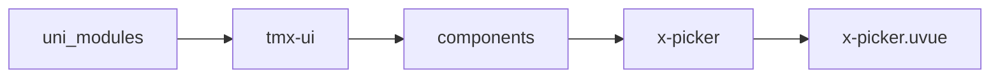
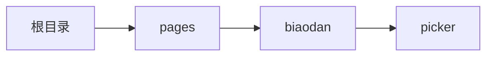

# 选择器 xPicker
-------
<ViewMobile url="/pages/biaodan/picker" />

## 介绍

组件采用数组id式选择，非索引。考虑到实际实用中多以id为交互提交数据。因此摒弃了传统的索引选项

## 平台兼容

| Harmony | H5 | andriod | IOS | 小程序 | UTS | UNIAPP-X SDK | version |
| --- | --- | --- | --- | --- | --- | --- | --- |
| ☑ | ☑ | ☑️ | ☑️ | ☑️ | ☑️ | 4.76+ | 1.1.18 |


## 文件路径

``` ts

@/uni_modules/tmx-ui/components/x-picker/x-picker.uvue
```



## 使用

``` ts

<x-picker></x-picker>
```

## Props 属性

| 名称 | 说明 | 类型 | 默认值 |
| ------ | ---- | ---- | ---- |
| list | `数据项同x-picker-view的PICKER_ITEM_INFO`<br> | `Array` | `() => [] as PICKER_ITEM_INFO[]` |
| modelValue | `当前选中项的id值`<br> | `Array` | `() => [] as string[]` |
| modelStr | `当前选中项的回显文本等同v-model:model-str`<br>`请不要更改此值，此值只对外输出显示。`<br>`如果空值，将内部首次递归渲染回显文本。如果你后台返回，就不会计算。`<br>`因此如果对性能有要求的请务必让后台在首次显示时先回显文本，`<br>`这样内部在第一次时不会递归计算回显文本，提高性能。`<br> | `string` | `""` |
| modelShow | `当前打开的状态。`<br>`等同v-model:model-show`<br> | `boolean` | `false` |
| title | `顶部标题`<br> | `string` | `""` |
| cancelText | `取消按钮的文本`<br> | `string` | `""` |
| confirmText | `确认按钮的文本`<br> | `string` | `""` |
| lazyContent | `是否懒加载内部内容。`<br>`当前你的列表内容非常多，且影响打开的动画性能时，请务必`<br>`设置此项为true，以获得流畅视觉效果。如果选择数据较少没有必要打开`<br>`注意:由于要兼容微信,此属性从1.1.9开始必须打开,除非不用微信小程序可以关闭.`<br> | `boolean` | `true` |
| cellUnits | `显示在顶部的单位名称`<br> | `Array` | `() => [] as string[]` |
| unitsFontSize | `单位字体大小`<br> | `string` | `'12'` |
| modelStrJoin | `自动同步modelstr拼接时的符号.`<br> | `string` | `","` |
| zIndex | `层级`<br> | `number` | `1100` |
| showClose | `是否显示关闭按钮`<br> | `boolean` | `false` |
| disabled | `是否禁用弹出`<br> | `boolean` | `false` |
| widthCoverCenter | `宽屏时是否让内容剧中显示`<br>`并限制其宽为屏幕宽，只展示中间内容以适应宽屏。`<br> | `boolean` | `false` |
| customWrapStyle | `自定义容器背景层样式`<br> | `string` | `""` |


## Events 事件

| 名称 | 参数 | 说明 |
| ------ | ---- | ---- |
| cancel | `-` | 取消时触发 |
| confirm | `ids: string[]` | 确认触发 |
| change | `ids: string[]` | 滑动变换时触发 |
| update:modelShow | `-` | 变量控制打开状态<br>等同v-model:model-show |
| update:modelStr | `-` | 等同v-model:model-str<br>只对外输出当前回选区的选中项的文本，不要外部改变此值。 |
| update:modelValue | `-` | - |


## Slots 插槽

| 名称 | 说明 | 数据 |
| ------ | ---- | ---- |
| default | `插槽,默认触发打开选择器。你的默认布局可以放置在这里。` | label: string<br> |


## Ref 方法

| 名称 | 参数 | 返回值 | 说明 |
| ------ | ---- | ---- | ---- |


## 示例文件路径

``` json

/pages/biaodan/picker
```



## 示例源码

::: details uvue

<<< ../../../../pages/biaodan/picker.uvue{vue}

:::

