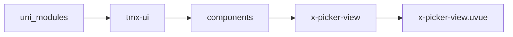

# 选择器容器 xPickerView
-------
<ViewMobile url="/pages/biaodan/picker-view" />

## 介绍

采用id作为索引为选中值。

## 平台兼容

| Harmony | H5 | andriod | IOS | 小程序 | UTS | UNIAPP-X SDK | version |
| --- | --- | --- | --- | --- | --- | --- | --- |
| ☑ | ☑ | ☑️ | ☑️ | ☑️ | ☑️ | 4.76+ | 1.1.19 |


## 文件路径

``` ts

@/uni_modules/tmx-ui/components/x-picker-view/x-picker-view.uvue
```



## 使用

``` ts

<x-picker-view></x-picker-view>
```

## Props 属性

| 名称 | 说明 | 类型 | 默认值 |
| ------ | ---- | ---- | ---- |
| list | `数据`<br> | `Array` | `(): Array<PICKER_ITEM_INFO> => [] as Array<PICKER_ITEM_INFO>` |
| listPro | `数据项,这是内部使用的以提高数据的转换性能。如果你确定你提供的是这个类型，可以赋值此值，避免转换时间。`<br>`格式类型为：X_PICKER_X_ITEM`<br>`数据如果超过1mb不要去转换，最后直接从后台提供string然后直接JSON.getArray<X_PICKER_X_ITEM>(data)赋值到值。`<br>`这样性能在安卓上可以提高到好多。`<br> | `Array` | `(): Array<X_PICKER_X_ITEM> => [] as Array<X_PICKER_X_ITEM>` |
| modelValue | `当前选中项的id值`<br> | `Array` | `(): Array<string   number> => [] as Array<string   number>` |
| modelStr | `当前选中项的标题文本`<br> | `string` | `''` |
| modelStrJoin | `自动同步modelstr拼接时的符号.`<br> | `string` | `','` |
| cellUnits | `显示在顶部的单位名称`<br> | `Array` | `(): Array<string> => [] as Array<string>` |
| unitsFontSize | `单位名称字号`<br> | `string` | `'12'` |
| fontSize | `项目的字体号大小`<br> | `string` | `'16'` |


## Events 事件

| 名称 | 参数 | 说明 |
| ------ | ---- | ---- |
| change | `ids: string[]` | 选项变化时触发 |
| update:modelStr | `-` | 等同v-model:model-str<br>只对外输出当前回选区的选中项的文本，不要外部改变此值。 |
| update:modelValue | `-` | - |


## Slots 插槽

| 名称 | 说明 | 数据 |
| ------ | ---- | ---- |
| label | `-` | - |


## Ref 方法

| 名称 | 参数 | 返回值 | 说明 |
| ------ | ---- | ---- | ---- |


## 示例文件路径

``` json

/pages/biaodan/picker-view
```


## 示例源码

::: details uvue

<<< ../../../../pages/biaodan/picker-view.uvue{vue}

:::

