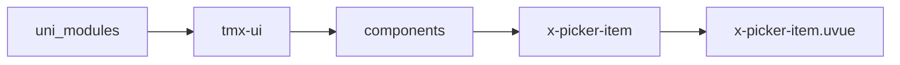
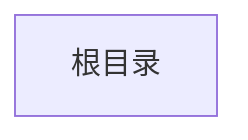

# 选择容器子节点 xPickerViewItem
-------
<ViewMobile url="" />

## 介绍

xPickerView内部子组件，不可引用

## 平台兼容

| Harmony | H5 | andriod | IOS | 小程序 | UTS | UNIAPP-X SDK | version |
| --- | --- | --- | --- | --- | --- | --- | --- |
| ☑ | ☑ | ☑️ | ☑️ | ☑️ | ☑️ | 4.76+ | 1.1.18 |


## 文件路径

``` ts

@/uni_modules/tmx-ui/components/x-picker-item/x-picker-item.uvue
```



## 使用

``` ts

<x-picker-item></x-picker-item>
```

## Props 属性

| 名称 | 说明 | 类型 | 默认值 |
| ------ | ---- | ---- | ---- |
| cellHeight | ``<br> | `string` | `'60'` |
| duration | ``<br> | `number` | `350` |
| list | ``<br> | `X_PICKER_X_ITEM[]` | `() : X_PICKER_X_ITEM[] => [] as X_PICKER_X_ITEM[]` |
| wrapWight | ``<br> | `number` | `0` |
| parentIndex | ``<br> | `number` | `0` |
| selectedIndex | ``<br> | `number[]` | `() : number[] => [] as number[]` |
| cellUnits | ``<br> | `string[]` | `() : string[] => [] as string[]` |
| unitsFontSize | ``<br> | `string` | `'12'` |
| fontSize | ``<br> | `string` | `"15"` |


## Events 事件

| 名称 | 参数 | 说明 |
| ------ | ---- | ---- |
| changeDeep | `-` | - |
| countChange | `-` | - |


## Slots 插槽

| 名称 | 说明 | 数据 |
| ------ | ---- | ---- |


## Ref 方法

| 名称 | 参数 | 返回值 | 说明 |
| ------ | ---- | ---- | ---- |


## 示例文件路径

``` json


```



## 示例源码

::: details uvue


:::

