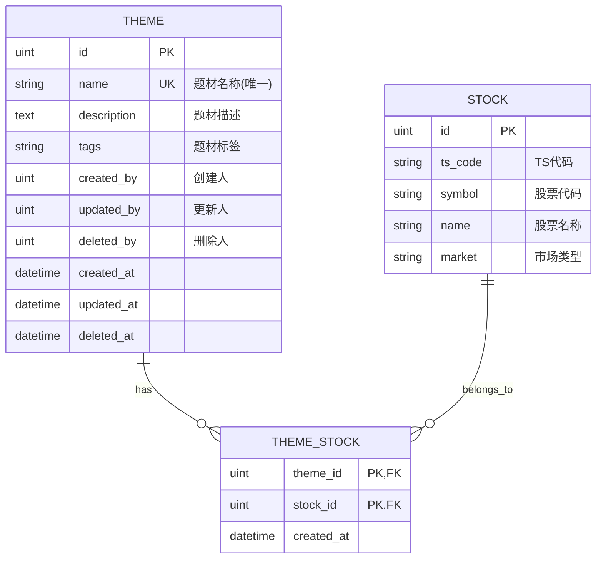

# 设计文档 - A股股票题材宝典

## 概述

A股股票题材宝典是一个基于 gin-vue-admin 框架的题材管理系统，采用标准的三层架构设计（API -> Service -> Model）。系统实现了题材的全生命周期管理和题材与股票之间的多对多关联关系管理。

### 核心功能

- 题材基础信息的增删改查
- 题材列表的分页查询和多条件搜索
- 题材与股票的关联关系管理
- 双向查询支持（题材查股票、股票查题材）
- 批量操作支持

### 技术栈

- **后端框架**: Gin (Go web framework)
- **ORM**: GORM
- **数据库**: MySQL 8.0+
- **架构模式**: 分层架构 (API -> Service -> Model)

### 设计原则

1. **模块化**: 遵循 gin-vue-admin 的模块化设计，代码结构清晰
2. **可扩展性**: 支持未来扩展更多题材属性和关联关系
3. **数据完整性**: 使用外键约束和事务保证数据一致性
4. **性能优化**: 支持分页查询、索引优化、批量操作
5. **权限控制**: 集成现有的用户认证和操作记录机制

## 架构设计

### 分层架构

系统采用经典的三层架构设计，参考 quant 模块的实现模式：

```
┌─────────────────────────────────────────────────────────────┐
│                         API Layer                            │
│  (api/v1/quant/theme.go)                                     │
│  - HTTP 请求处理                                              │
│  - 参数验证和绑定                                             │
│  - 响应格式化                                                 │
│  - 错误处理                                                   │
└──────────────────────┬──────────────────────────────────────┘
                       │
                       ▼
┌─────────────────────────────────────────────────────────────┐
│                      Service Layer                           │
│  (service/quant/theme.go)                                    │
│  - 业务逻辑处理                                               │
│  - 数据验证                                                   │
│  - 事务管理                                                   │
│  - 数据转换                                                   │
└──────────────────────┬──────────────────────────────────────┘
                       │
                       ▼
┌─────────────────────────────────────────────────────────────┐
│                       Model Layer                            │
│  (model/quant/theme.go, theme_stock.go)                     │
│  - 数据模型定义                                               │
│  - GORM 映射配置                                              │
│  - 表关系定义                                                 │
└─────────────────────────────────────────────────────────────┘
                       │
                       ▼
┌─────────────────────────────────────────────────────────────┐
│                      Database (MySQL)                        │
│  - addon_quant_theme (题材表)                                │
│  - addon_quant_theme_stock (关联表)                          │
│  - addon_quant_base_stock (股票表 - 已存在)                  │
└─────────────────────────────────────────────────────────────┘
```

### 模块结构

遵循 gin-vue-admin 的标准目录结构：

```
server/
├── api/v1/quant/
│   ├── theme.go                    # 题材 API 处理器
│   └── enter.go                    # 注册 ThemeApi (修改)
├── service/quant/
│   ├── theme.go                    # 题材业务逻辑
│   └── enter.go                    # 注册 ThemeService (修改)
├── model/quant/
│   ├── theme.go                    # 题材数据模型
│   ├── theme_stock.go              # 题材-股票关联模型
│   └── request/
│       └── theme.go                # 题材请求参数结构体
├── router/quant/
│   ├── theme.go                    # 题材路由定义
│   └── enter.go                    # 注册 ThemeRouter (修改)
└── initialize/
    └── router.go                   # 注册路由组 (修改)
```

### 路由设计

基于 RESTful API 设计原则，路由前缀为 `/quant/theme`：

| HTTP 方法 | 路径                            | 功能                   | 中间件                 |
| --------- | ------------------------------- | ---------------------- | ---------------------- |
| POST      | `/quant/theme/createTheme`      | 创建题材               | Auth + OperationRecord |
| PUT       | `/quant/theme/updateTheme`      | 更新题材               | Auth + OperationRecord |
| DELETE    | `/quant/theme/deleteTheme`      | 删除题材               | Auth + OperationRecord |
| DELETE    | `/quant/theme/deleteThemeByIds` | 批量删除题材           | Auth + OperationRecord |
| GET       | `/quant/theme/findTheme`        | 查询题材详情           | Auth                   |
| GET       | `/quant/theme/getThemeList`     | 分页查询题材列表       | Auth                   |
| POST      | `/quant/theme/addStocks`        | 为题材添加股票关联     | Auth + OperationRecord |
| DELETE    | `/quant/theme/removeStocks`     | 删除题材的股票关联     | Auth + OperationRecord |
| GET       | `/quant/theme/getThemeStocks`   | 查询题材关联的股票列表 | Auth                   |
| GET       | `/quant/theme/getStockThemes`   | 查询股票关联的题材列表 | Auth                   |

## 组件和接口

### API 层 (api/v1/quant/theme.go)

#### ThemeApi 结构体

```go
type ThemeApi struct{}
```

#### API 方法定义

**1. CreateTheme - 创建题材**

```go
func (themeApi *ThemeApi) CreateTheme(c *gin.Context)
```

- 输入: `quant.Theme` (JSON body)
- 输出: `response.Response{msg=string}`
- 功能: 创建新题材，记录创建人
- 验证: 题材名称非空、长度限制、唯一性

**2. UpdateTheme - 更新题材**

```go
func (themeApi *ThemeApi) UpdateTheme(c *gin.Context)
```

- 输入: `quant.Theme` (JSON body)
- 输出: `response.Response{msg=string}`
- 功能: 更新题材信息，记录更新人和更新时间

**3. DeleteTheme - 删除题材**

```go
func (themeApi *ThemeApi) DeleteTheme(c *gin.Context)
```

- 输入: `id` (query parameter)
- 输出: `response.Response{msg=string}`
- 功能: 软删除题材及其所有关联关系

**4. DeleteThemeByIds - 批量删除题材**

```go
func (themeApi *ThemeApi) DeleteThemeByIds(c *gin.Context)
```

- 输入: `ids[]` (query parameter array)
- 输出: `response.Response{msg=string}`
- 功能: 批量软删除题材及其关联关系

**5. FindTheme - 查询题材详情**

```go
func (themeApi *ThemeApi) FindTheme(c *gin.Context)
```

- 输入: `id` (query parameter)
- 输出: `response.Response{data=quant.Theme, msg=string}`
- 功能: 根据 ID 查询题材详细信息

**6. GetThemeList - 分页查询题材列表**

```go
func (themeApi *ThemeApi) GetThemeList(c *gin.Context)
```

- 输入: `quantReq.ThemeSearch` (query parameters)
- 输出: `response.Response{data=response.PageResult, msg=string}`
- 功能: 分页查询题材列表，支持多条件搜索和排序

**7. AddStocks - 为题材添加股票关联**

```go
func (themeApi *ThemeApi) AddStocks(c *gin.Context)
```

- 输入: `quantReq.ThemeStockRequest` (JSON body)
  - `theme_id`: 题材 ID
  - `stock_ids`: 股票 ID 数组
- 输出: `response.Response{msg=string}`
- 功能: 批量添加题材与股票的关联关系，自动去重

**8. RemoveStocks - 删除题材的股票关联**

```go
func (themeApi *ThemeApi) RemoveStocks(c *gin.Context)
```

- 输入: `quantReq.ThemeStockRequest` (JSON body)
  - `theme_id`: 题材 ID
  - `stock_ids`: 股票 ID 数组
- 输出: `response.Response{msg=string}`
- 功能: 批量删除题材与股票的关联关系

**9. GetThemeStocks - 查询题材关联的股票列表**

```go
func (themeApi *ThemeApi) GetThemeStocks(c *gin.Context)
```

- 输入: `quantReq.ThemeStockSearch` (query parameters)
  - `theme_id`: 题材 ID (必填)
  - 分页参数
- 输出: `response.Response{data=response.PageResult, msg=string}`
- 功能: 分页查询指定题材下的所有关联股票

**10. GetStockThemes - 查询股票关联的题材列表**

```go
func (themeApi *ThemeApi) GetStockThemes(c *gin.Context)
```

- 输入: `quantReq.StockThemeSearch` (query parameters)
  - `stock_id`: 股票 ID (必填)
  - 分页参数
- 输出: `response.Response{data=response.PageResult, msg=string}`
- 功能: 分页查询指定股票所属的所有题材

### Service 层 (service/quant/theme.go)

#### ThemeService 结构体

```go
type ThemeService struct{}
```

#### Service 方法定义

**1. CreateTheme - 创建题材**

```go
func (themeService *ThemeService) CreateTheme(ctx context.Context, theme *quant.Theme) error
```

- 验证题材名称非空、长度 1-100 字符
- 检查题材名称唯一性
- 创建题材记录

**2. UpdateTheme - 更新题材**

```go
func (themeService *ThemeService) UpdateTheme(ctx context.Context, theme quant.Theme) error
```

- 验证题材存在
- 验证题材名称唯一性（排除自身）
- 更新题材信息

**3. DeleteTheme - 删除题材**

```go
func (themeService *ThemeService) DeleteTheme(ctx context.Context, id string, userID uint) error
```

- 使用事务保证数据一致性
- 软删除题材记录
- 删除该题材的所有股票关联关系

**4. DeleteThemeByIds - 批量删除题材**

```go
func (themeService *ThemeService) DeleteThemeByIds(ctx context.Context, ids []string, userID uint) error
```

- 使用事务保证数据一致性
- 批量软删除题材记录
- 批量删除这些题材的所有股票关联关系

**5. GetTheme - 获取题材详情**

```go
func (themeService *ThemeService) GetTheme(ctx context.Context, id string) (quant.Theme, error)
```

- 根据 ID 查询题材详细信息
- 题材不存在时返回错误

**6. GetThemeInfoList - 分页查询题材列表**

```go
func (themeService *ThemeService) GetThemeInfoList(ctx context.Context, info quantReq.ThemeSearch) ([]quant.Theme, int64, error)
```

- 支持按名称模糊搜索
- 支持按标签筛选
- 支持按创建时间/更新时间排序
- 返回分页结果和总数

**7. AddStocks - 添加题材-股票关联**

```go
func (themeService *ThemeService) AddStocks(ctx context.Context, themeID uint, stockIDs []uint) error
```

- 验证题材存在
- 验证所有股票存在
- 检查关联关系是否已存在，避免重复添加
- 批量创建关联记录

**8. RemoveStocks - 删除题材-股票关联**

```go
func (themeService *ThemeService) RemoveStocks(ctx context.Context, themeID uint, stockIDs []uint) error
```

- 验证题材存在
- 批量删除指定的关联关系
- 不影响题材和股票本身

**9. GetThemeStocks - 查询题材的股票列表**

```go
func (themeService *ThemeService) GetThemeStocks(ctx context.Context, info quantReq.ThemeStockSearch) ([]quant.BaseStock, int64, error)
```

- 验证题材存在
- 通过关联表 JOIN 查询股票信息
- 返回股票的基础信息（代码、名称、市场等）
- 支持分页

**10. GetStockThemes - 查询股票的题材列表**

```go
func (themeService *ThemeService) GetStockThemes(ctx context.Context, info quantReq.StockThemeSearch) ([]quant.Theme, int64, error)
```

- 验证股票存在
- 通过关联表 JOIN 查询题材信息
- 返回题材的基础信息（名称、描述、标签等）
- 支持分页

## 数据模型

### 题材表 (addon_quant_theme)

```go
// Theme 题材数据模型
type Theme struct {
    global.GVA_MODEL_ADDON              // 包含 ID, CreatedAt, UpdatedAt, DeletedAt
    Name        string  `json:"name" gorm:"column:name;size:100;not null;uniqueIndex:idx_theme_name;comment:题材名称"`
    Description *string `json:"description" gorm:"column:description;type:text;comment:题材描述"`
    Tags        *string `json:"tags" gorm:"column:tags;size:500;comment:题材标签(逗号分隔)"`
    CreatedBy   uint    `gorm:"column:created_by;comment:创建者"`
    UpdatedBy   uint    `gorm:"column:updated_by;comment:更新者"`
    DeletedBy   uint    `gorm:"column:deleted_by;comment:删除者"`

    // 关联关系
    Stocks []BaseStock `gorm:"many2many:addon_quant_theme_stock;"`
}

func (Theme) TableName() string {
    return "addon_quant_theme"
}
```

**字段说明**:

- `id`: 主键，自增
- `name`: 题材名称，必填，长度 1-100，唯一索引
- `description`: 题材描述，可选，文本类型
- `tags`: 题材标签，可选，多个标签用逗号分隔
- `created_by`: 创建人 ID，关联用户表
- `updated_by`: 更新人 ID，关联用户表
- `deleted_by`: 删除人 ID，关联用户表
- `created_at`: 创建时间，自动管理
- `updated_at`: 更新时间，自动管理
- `deleted_at`: 软删除时间，软删除标记

**索引设计**:

- 唯一索引: `idx_theme_name` (name) - 保证题材名称唯一
- 索引: `idx_theme_deleted_at` (deleted_at) - 加速软删除查询

### 题材-股票关联表 (addon_quant_theme_stock)

```go
// ThemeStock 题材-股票关联模型
type ThemeStock struct {
    ThemeID uint      `gorm:"column:theme_id;primaryKey;comment:题材ID"`
    StockID uint      `gorm:"column:stock_id;primaryKey;comment:股票ID"`
    CreatedAt time.Time `gorm:"column:created_at;comment:创建时间"`
}

func (ThemeStock) TableName() string {
    return "addon_quant_theme_stock"
}
```

**字段说明**:

- `theme_id`: 题材 ID，联合主键，外键关联 `addon_quant_theme.id`
- `stock_id`: 股票 ID，联合主键，外键关联 `addon_quant_base_stock.id`
- `created_at`: 关联创建时间

**索引设计**:

- 联合主键: (theme_id, stock_id) - 防止重复关联
- 索引: `idx_stock_id` (stock_id) - 加速反向查询（股票查题材）
- 外键约束:
  - `fk_theme_stock_theme` FOREIGN KEY (theme_id) REFERENCES addon_quant_theme(id) ON DELETE CASCADE
  - `fk_theme_stock_stock` FOREIGN KEY (stock_id) REFERENCES addon_quant_base_stock(id) ON DELETE CASCADE

### 请求参数模型 (model/quant/request/theme.go)

```go
// ThemeSearch 题材搜索条件
type ThemeSearch struct {
    Name      *string `json:"name" form:"name"`           // 题材名称模糊搜索
    Tags      *string `json:"tags" form:"tags"`           // 标签筛选
    OrderKey  string  `json:"orderKey" form:"orderKey"`   // 排序字段: created_at, updated_at
    OrderDesc bool    `json:"desc" form:"desc"`           // 是否降序
    request.PageInfo                                       // 分页参数
}

// ThemeStockRequest 题材-股票关联操作请求
type ThemeStockRequest struct {
    ThemeID  uint   `json:"theme_id" binding:"required"` // 题材 ID
    StockIDs []uint `json:"stock_ids" binding:"required,min=1"` // 股票 ID 数组
}

// ThemeStockSearch 查询题材的股票列表
type ThemeStockSearch struct {
    ThemeID uint `json:"theme_id" form:"theme_id" binding:"required"` // 题材 ID
    request.PageInfo
}

// StockThemeSearch 查询股票的题材列表
type StockThemeSearch struct {
    StockID uint `json:"stock_id" form:"stock_id" binding:"required"` // 股票 ID
    request.PageInfo
}
```

### 数据库 ER 图



## 正确性属性

_属性是一个应该在系统所有有效执行中保持为真的特征或行为——本质上是关于系统应该做什么的形式化陈述。属性充当人类可读规范和机器可验证正确性保证之间的桥梁。_

本系统适合使用属性测试来验证核心业务逻辑的正确性。以下属性基于需求文档中的验收标准，通过生成随机测试数据来验证系统在各种输入下的行为。

### 属性 1: 题材创建和查询往返一致性

*对于任意*有效的题材数据（名称、描述、标签），创建题材后通过 ID 查询应该返回完全相同的数据（除了系统自动生成的字段如 ID、时间戳等）。

**验证需求**: 1.1, 1.8

### 属性 2: 题材名称唯一性约束

*对于任意*已存在的题材名称，尝试创建同名题材应该失败并返回唯一性约束错误。

**验证需求**: 1.3

### 属性 3: 题材更新完整性

*对于任意*存在的题材和新的有效数据，更新操作后：

- 查询到的数据应该等于更新的新值
- `updated_at` 时间戳应该晚于 `created_at`
- `updated_by` 字段应该被正确设置

**验证需求**: 1.4, 1.5

### 属性 4: 题材软删除及级联删除

*对于任意*存在的题材：

- 删除后通过普通查询应该无法找到该题材
- 使用 `Unscoped()` 查询应该能找到带有 `deleted_at` 标记的记录
- 该题材的所有股票关联关系应该被删除

**验证需求**: 1.6, 1.7, 7.6

### 属性 5: 批量删除题材的完整性

*对于任意*多个存在的题材，批量删除后：

- 所有被删除的题材都应该无法查询到
- 这些题材的所有股票关联关系都应该被删除

**验证需求**: 6.1, 6.2

### 属性 6: 分页查询的一致性

*对于任意*页码和页大小参数：

- 返回的记录数应该 ≤ 页大小
- 总记录数应该等于数据库中实际的题材数量
- 所有分页结果合并后应该包含所有题材（无遗漏、无重复）

**验证需求**: 2.1

### 属性 7: 模糊搜索的准确性

*对于任意*搜索关键词，返回的所有题材的 `name` 字段都应该包含该关键词（不区分大小写）。

**验证需求**: 2.3

### 属性 8: 标签筛选的准确性

*对于任意*标签值，返回的所有题材的 `tags` 字段都应该包含该标签。

**验证需求**: 2.4

### 属性 9: 排序功能的正确性

*对于任意*排序字段（created_at 或 updated_at）和排序方向（升序或降序），返回的题材列表应该按照指定字段和方向正确排序。

**验证需求**: 2.5

### 属性 10: 题材-股票关联的创建和查询一致性

*对于任意*有效的题材ID和股票ID列表：

- 添加关联后，通过"查询题材的股票"接口应该能查询到所有添加的股票
- 通过"查询股票的题材"接口应该能查询到该题材
- 双向查询结果应该一致

**验证需求**: 3.1, 4.1, 5.1

### 属性 11: 关联关系的幂等性

*对于任意*已存在的题材-股票关联，重复添加该关联应该：

- 要么被系统忽略（不返回错误）
- 要么返回明确的"已存在"错误
- 不会在数据库中产生重复记录

**验证需求**: 3.3

### 属性 12: 删除关联的隔离性

*对于任意*存在的题材-股票关联：

- 删除关联后，该关联应该无法查询到
- 题材本身应该仍然存在且可查询
- 股票本身应该仍然存在且可查询

**验证需求**: 3.4, 3.6

### 属性 13: 批量删除关联的完整性

*对于任意*题材和多个关联的股票，批量删除这些关联后，所有指定的关联都应该无法查询到。

**验证需求**: 3.5

### 属性 14: 题材关联股票分页查询的一致性

*对于任意*题材和分页参数：

- 返回的股票数量应该 ≤ 页大小
- 总数应该等于该题材实际关联的股票数量
- 所有分页结果合并后应该包含该题材的所有关联股票

**验证需求**: 4.2

### 属性 15: 股票关联题材分页查询的一致性

*对于任意*股票和分页参数：

- 返回的题材数量应该 ≤ 页大小
- 总数应该等于该股票实际关联的题材数量
- 所有分页结果合并后应该包含该股票的所有关联题材

**验证需求**: 5.2

### 属性 16: 审计字段的完整性

*对于任意*新创建的题材：

- `created_by` 字段应该等于当前操作用户ID
- `created_at` 字段应该被自动设置且接近当前时间
- `updated_at` 字段应该等于 `created_at`（首次创建时）

**验证需求**: 7.1

### 属性 17: API 成功响应格式的一致性

*对于任意*成功的 API 调用，响应应该：

- 包含 `code` 字段（值为 0 表示成功）
- 包含 `msg` 字段（描述性消息）
- 包含 `data` 字段（对于有返回数据的接口）

**验证需求**: 8.11

### 属性 18: API 错误响应格式的一致性

*对于任意*失败的 API 调用（如无效参数、资源不存在等），响应应该：

- 包含非零的 `code` 字段
- 包含描述性的 `msg` 字段
- 保持统一的错误响应结构

**验证需求**: 8.12

## 错误处理

### 错误分类

系统采用统一的错误处理机制，错误分为以下几类：

1. **参数验证错误** (400 Bad Request)
   - 缺少必需参数
   - 参数类型错误
   - 参数值超出范围（如名称长度）
   - 参数格式错误

2. **业务逻辑错误** (400 Bad Request)
   - 题材名称重复
   - 关联关系已存在
   - 资源不存在（题材ID、股票ID）
   - 操作冲突

3. **权限错误** (403 Forbidden)
   - 未登录用户尝试操作
   - 用户无操作权限

4. **系统错误** (500 Internal Server Error)
   - 数据库连接失败
   - 事务执行失败
   - 未预期的系统异常

### 错误处理策略

**API 层错误处理**:

```go
// 参数绑定错误
if err := c.ShouldBindJSON(&theme); err != nil {
    response.FailWithMessage(err.Error(), c)
    return
}

// 业务逻辑错误
if err := themeService.CreateTheme(ctx, &theme); err != nil {
    global.GVA_LOG.Error("创建失败!", zap.Error(err))
    response.FailWithMessage("创建失败:" + err.Error(), c)
    return
}

// 成功响应
response.OkWithMessage("创建成功", c)
```

**Service 层错误处理**:

```go
// 参数验证
if theme.Name == "" || len(theme.Name) > 100 {
    return errors.New("题材名称不能为空且长度不超过100字符")
}

// 唯一性检查
var count int64
if err := db.Model(&quant.Theme{}).Where("name = ?", theme.Name).Count(&count).Error; err != nil {
    return err
}
if count > 0 {
    return errors.New("题材名称已存在")
}

// 数据库操作错误
if err := db.Create(theme).Error; err != nil {
    return fmt.Errorf("创建题材失败: %w", err)
}
```

**事务错误处理**:

```go
err = global.GVA_DB.Transaction(func(tx *gorm.DB) error {
    // 删除题材
    if err := tx.Model(&quant.Theme{}).Where("id = ?", id).Update("deleted_by", userID).Error; err != nil {
        return err
    }
    if err := tx.Delete(&quant.Theme{}, "id = ?", id).Error; err != nil {
        return err
    }

    // 删除关联关系
    if err := tx.Where("theme_id = ?", id).Delete(&quant.ThemeStock{}).Error; err != nil {
        return err
    }

    return nil
})
```

### 错误响应格式

所有错误响应遵循统一格式：

```json
{
  "code": 7,
  "msg": "创建失败:题材名称已存在",
  "data": null
}
```

常见错误码：

- `7`: 业务逻辑错误
- `400`: 参数验证错误
- `403`: 权限错误
- `500`: 系统错误

## 测试策略

### 测试方法

本系统采用**双重测试策略**：

1. **单元测试 (Unit Tests)**: 测试具体场景、边界条件和错误处理
2. **属性测试 (Property-Based Tests)**: 验证系统在各种随机输入下的通用属性

两种测试方法是互补的：

- 单元测试关注特定的业务场景和边界情况
- 属性测试通过大量随机数据验证系统的通用正确性

### 属性测试配置

**测试框架**: 使用 Go 的属性测试框架（如 `gopter` 或 `rapid`）

**测试配置**:

- 每个属性测试运行最少 **100 次迭代**（由于随机化特性）
- 每个测试用例标注对应的设计属性编号
- 标注格式: `// Feature: stock-theme-encyclopedia, Property {N}: {属性描述}`

**示例**:

```go
// Feature: stock-theme-encyclopedia, Property 1: 题材创建和查询往返一致性
func TestThemeCreateAndQueryRoundTrip(t *testing.T) {
    properties := gopter.NewProperties(nil)
    properties.Property("创建的题材可以通过ID查询到相同数据", prop.ForAll(
        func(name string, desc string, tags string) bool {
            // 生成随机题材数据
            theme := &quant.Theme{
                Name: name,
                Description: &desc,
                Tags: &tags,
            }

            // 创建题材
            err := themeService.CreateTheme(ctx, theme)
            if err != nil {
                return false
            }

            // 查询题材
            retrieved, err := themeService.GetTheme(ctx, fmt.Sprint(theme.ID))
            if err != nil {
                return false
            }

            // 验证数据一致性
            return retrieved.Name == theme.Name &&
                   *retrieved.Description == *theme.Description &&
                   *retrieved.Tags == *theme.Tags
        },
        gen.AlphaString().WithLabel("name"),
        gen.AlphaString().WithLabel("description"),
        gen.AlphaString().WithLabel("tags"),
    ))

    properties.TestingRun(t, gopter.ConsoleReporter(false))
}
```

### 单元测试策略

单元测试聚焦于以下方面：

**1. API 层测试**

- 参数绑定和验证
- HTTP 状态码正确性
- 响应格式正确性
- 错误处理

**2. Service 层测试**

- 业务逻辑正确性
- 边界条件（空字符串、长度限制、边界值）
- 错误场景（资源不存在、重复数据、权限问题）
- 事务一致性

**3. Model 层测试**

- GORM 模型定义正确性
- 表关系映射
- 索引和约束

### 测试覆盖目标

- **代码覆盖率**: 目标 ≥ 80%
- **分支覆盖率**: 目标 ≥ 75%
- **关键路径**: 100% 覆盖（CRUD 操作、关联管理）

### 集成测试

**数据库集成测试**:

- 使用测试数据库（独立于开发和生产环境）
- 每个测试前清理数据
- 测试真实的数据库约束（外键、唯一索引）

**API 集成测试**:

- 使用 `httptest` 模拟 HTTP 请求
- 测试完整的请求-响应流程
- 测试中间件（认证、操作记录）

### 测试数据生成

**属性测试数据生成器**:

```go
// 生成有效的题材名称（1-100字符）
func genThemeName() gopter.Gen {
    return gen.AlphaString().
        SuchThat(func(s string) bool {
            return len(s) >= 1 && len(s) <= 100
        })
}

// 生成题材标签（逗号分隔）
func genThemeTags() gopter.Gen {
    return gen.SliceOf(gen.AlphaString()).
        Map(func(tags []string) string {
            return strings.Join(tags, ",")
        })
}

// 生成股票ID列表
func genStockIDs() gopter.Gen {
    return gen.SliceOfN(10, gen.UInt())
}
```

### 测试环境

**测试配置**:

- 独立的测试数据库: `test_gva`
- 测试配置文件: `config.test.yaml`
- CI/CD 集成: 自动运行所有测试

**测试前置条件**:

- 数据库已初始化
- 测试数据已准备（基础股票数据）
- 测试用户已创建

## 实现注意事项

### 性能优化

**1. 数据库索引**

- 题材名称唯一索引: 加速唯一性检查和名称搜索
- 软删除索引: 加速带 `deleted_at` 条件的查询
- 关联表索引: 加速双向关联查询

**2. 分页查询优化**

- 避免大偏移量分页（`LIMIT offset, count`）
- 对于大数据集，考虑使用游标分页
- 缓存总数查询结果（适用于变化不频繁的场景）

**3. 批量操作优化**

```go
// 使用 GORM 的 CreateInBatches 进行批量插入
tx.CreateInBatches(themeStocks, 100) // 每批100条

// 使用 IN 查询替代循环查询
tx.Where("id IN ?", ids).Find(&themes)
```

**4. N+1 查询问题**

```go
// 使用 Preload 预加载关联数据
db.Preload("Stocks").Find(&themes)

// 或使用 Joins 进行一次性查询
db.Joins("LEFT JOIN addon_quant_theme_stock ON ...").Find(&themes)
```

### 并发安全

**1. 唯一性检查的竞态条件**

存在竞态条件：两个并发请求同时检查题材名称不存在，然后都尝试创建。

**解决方案**:

- 依赖数据库的唯一索引约束（主要防护）
- Service 层的检查作为早期失败机制（减少数据库压力）
- 捕获唯一约束冲突错误，返回友好提示

```go
if err := db.Create(theme).Error; err != nil {
    if mysqlErr, ok := err.(*mysql.MySQLError); ok {
        if mysqlErr.Number == 1062 { // Duplicate entry
            return errors.New("题材名称已存在")
        }
    }
    return err
}
```

**2. 关联操作的并发控制**

- 使用数据库事务保证原子性
- 关联表的联合主键防止重复插入
- `ON DUPLICATE KEY` 或 `INSERT IGNORE` 处理幂等性

### 数据一致性

**1. 软删除的级联处理**

题材软删除时，关联关系需要被物理删除（不是软删除），避免：

- 关联表数据膨胀
- 恢复题材时关联关系混乱

```go
// 题材软删除
tx.Delete(&quant.Theme{}, "id = ?", id)

// 关联关系物理删除（不使用软删除）
tx.Unscoped().Where("theme_id = ?", id).Delete(&quant.ThemeStock{})
```

**2. 外键约束**

使用外键约束保证引用完整性，但要注意：

- `ON DELETE CASCADE`: 物理删除题材时级联删除关联
- `ON DELETE SET NULL`: 不适用，因为关联表主键不能为 NULL
- 软删除不会触发外键的 CASCADE，需要应用层处理

**3. 事务边界**

所有涉及多表操作的场景都应该使用事务：

- 删除题材及其关联
- 批量删除
- 批量添加关联（如果需要先验证）

### 安全考虑

**1. SQL 注入防护**

- 使用 GORM 参数化查询（不拼接 SQL）
- 避免使用 `db.Raw()` 除非必要
- 所有用户输入通过 binding 验证

**2. 权限控制**

- 集成现有的 JWT 认证中间件
- 使用 Casbin 进行细粒度权限控制（如果需要）
- 操作记录中间件记录所有变更操作

**3. 输入验证**

```go
type Theme struct {
    Name string `json:"name" binding:"required,min=1,max=100"`
    Description *string `json:"description" binding:"omitempty,max=1000"`
    Tags *string `json:"tags" binding:"omitempty,max=500"`
}
```

**4. 输出过滤**

- 避免暴露敏感的内部字段
- 使用 DTO (Data Transfer Object) 控制输出结构
- 分页查询限制最大页大小（如 1000）

### 扩展性设计

**1. 模块解耦**

模块内部高内聚，与其他模块低耦合：

- 通过 `enter.go` 统一导出 API、Service
- 避免跨模块直接调用 Service
- 使用接口定义模块边界（如果需要）

**2. 配置外部化**

可能的配置项：

- 分页默认大小和最大限制
- 软删除是否启用
- 关联操作的批量大小限制

**3. 日志和监控**

```go
// 关键操作记录日志
global.GVA_LOG.Info("创建题材",
    zap.String("name", theme.Name),
    zap.Uint("user_id", theme.CreatedBy))

// 错误日志包含上下文
global.GVA_LOG.Error("删除题材失败",
    zap.String("theme_id", id),
    zap.Error(err))

// 性能监控（可选）
start := time.Now()
// ... 操作 ...
duration := time.Since(start)
if duration > 1*time.Second {
    global.GVA_LOG.Warn("慢查询",
        zap.Duration("duration", duration))
}
```

**4. 缓存策略（可选）**

对于读多写少的场景，可以考虑：

- Redis 缓存题材列表
- 缓存失效策略：TTL + 写操作主动失效
- 注意缓存一致性问题

### 数据迁移

**迁移脚本结构**:

```go
// 创建题材表
func CreateThemeTable(db *gorm.DB) error {
    return db.AutoMigrate(&quant.Theme{})
}

// 创建关联表
func CreateThemeStockTable(db *gorm.DB) error {
    if err := db.AutoMigrate(&quant.ThemeStock{}); err != nil {
        return err
    }

    // 添加外键约束
    return db.Exec(`
        ALTER TABLE addon_quant_theme_stock
        ADD CONSTRAINT fk_theme_stock_theme
        FOREIGN KEY (theme_id) REFERENCES addon_quant_theme(id) ON DELETE CASCADE,
        ADD CONSTRAINT fk_theme_stock_stock
        FOREIGN KEY (stock_id) REFERENCES addon_quant_base_stock(id) ON DELETE CASCADE
    `).Error
}

// 创建索引
func CreateThemeIndexes(db *gorm.DB) error {
    return db.Exec(`
        CREATE UNIQUE INDEX idx_theme_name ON addon_quant_theme(name);
        CREATE INDEX idx_theme_deleted_at ON addon_quant_theme(deleted_at);
        CREATE INDEX idx_stock_id ON addon_quant_theme_stock(stock_id);
    `).Error
}
```

## 实现路线图

### 阶段 1: 基础设施 (第 1-2 天)

**目标**: 搭建模块基础结构

1. 创建数据模型
   - `model/quant/theme.go`
   - `model/quant/theme_stock.go`
   - `model/quant/request/theme.go`

2. 数据库迁移
   - 创建表结构
   - 添加索引和约束
   - 测试迁移脚本

3. 注册模块
   - 更新 `enter.go` 文件
   - 注册路由组

### 阶段 2: 核心功能 (第 3-5 天)

**目标**: 实现题材 CRUD 和基本查询

1. Service 层实现
   - `CreateTheme`, `UpdateTheme`, `DeleteTheme`
   - `GetTheme`, `GetThemeInfoList`
   - 参数验证和错误处理

2. API 层实现
   - HTTP 处理器
   - 参数绑定
   - 响应格式化

3. Router 配置
   - 路由注册
   - 中间件配置

4. 单元测试
   - Service 层测试
   - API 层测试

### 阶段 3: 关联管理 (第 6-8 天)

**目标**: 实现题材-股票关联功能

1. Service 层实现
   - `AddStocks`, `RemoveStocks`
   - `GetThemeStocks`, `GetStockThemes`
   - 关联验证和去重

2. API 层实现
   - 关联操作处理器
   - 双向查询处理器

3. 单元测试和集成测试
   - 关联操作测试
   - 双向查询测试
   - 事务一致性测试

### 阶段 4: 高级功能 (第 9-10 天)

**目标**: 实现批量操作和高级查询

1. 批量操作
   - `DeleteThemeByIds`
   - 批量关联操作优化

2. 高级查询
   - 模糊搜索优化
   - 标签筛选
   - 排序功能

3. 性能优化
   - 索引优化
   - 查询优化
   - 批量操作优化

### 阶段 5: 测试和文档 (第 11-12 天)

**目标**: 完善测试覆盖和文档

1. 属性测试
   - 设置属性测试框架
   - 实现 18 个正确性属性测试
   - 达到 100+ 次迭代配置

2. 集成测试
   - 端到端测试
   - 数据库集成测试
   - 中间件集成测试

3. 文档完善
   - API 文档（Swagger）
   - 代码注释
   - 使用示例

4. Code Review 和重构
   - 代码规范检查
   - 性能 profiling
   - 重构优化

### 阶段 6: 部署和监控 (第 13-14 天)

**目标**: 准备生产环境部署

1. 配置管理
   - 生产环境配置
   - 环境变量管理

2. 数据初始化
   - 初始数据准备
   - 数据迁移脚本

3. 监控和日志
   - 日志配置
   - 性能监控
   - 错误追踪

4. 部署验证
   - 冒烟测试
   - 回归测试
   - 性能测试

## 总结

本设计文档为 A股股票题材宝典功能提供了完整的技术设计方案：

- **架构设计**: 采用成熟的三层架构，遵循 gin-vue-admin 项目规范
- **数据模型**: 设计了题材表、关联表和完整的索引约束
- **接口设计**: 提供 10 个 RESTful API 接口，覆盖所有业务场景
- **正确性保证**: 定义了 18 个正确性属性，通过属性测试验证系统行为
- **测试策略**: 结合单元测试和属性测试，目标代码覆盖率 ≥ 80%
- **实现路线**: 提供分阶段实现计划，预计 2 周完成开发和测试

该设计充分考虑了性能、安全性、可扩展性和可维护性，为后续实现提供了清晰的指导。
